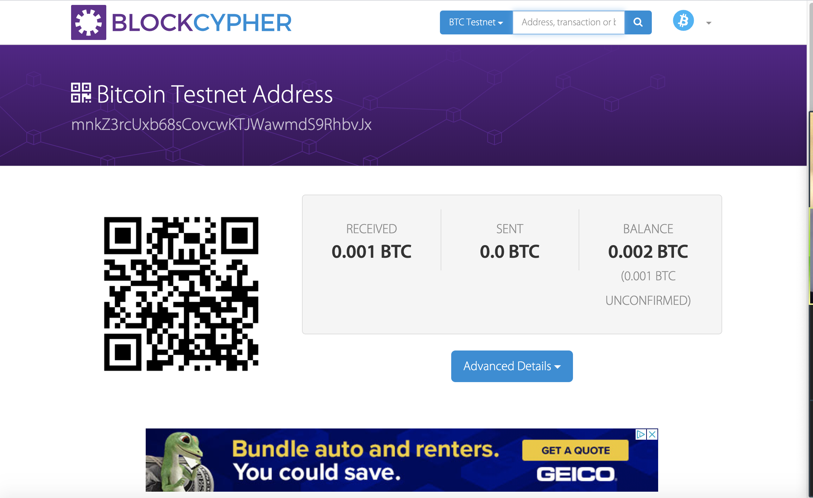
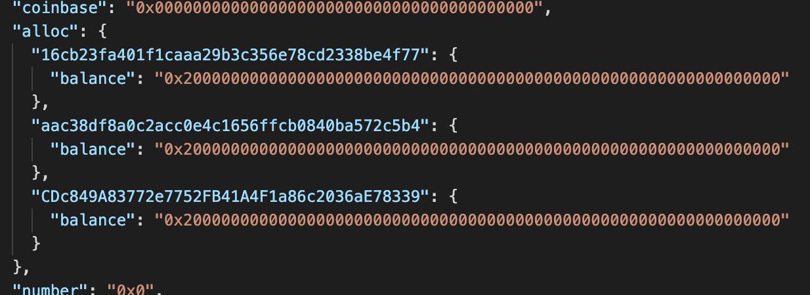
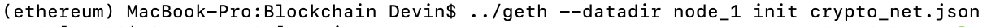
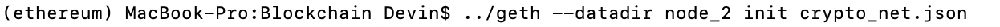
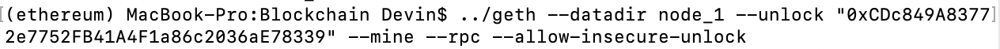
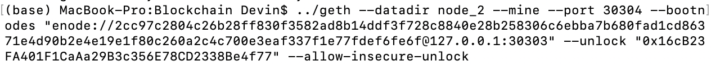
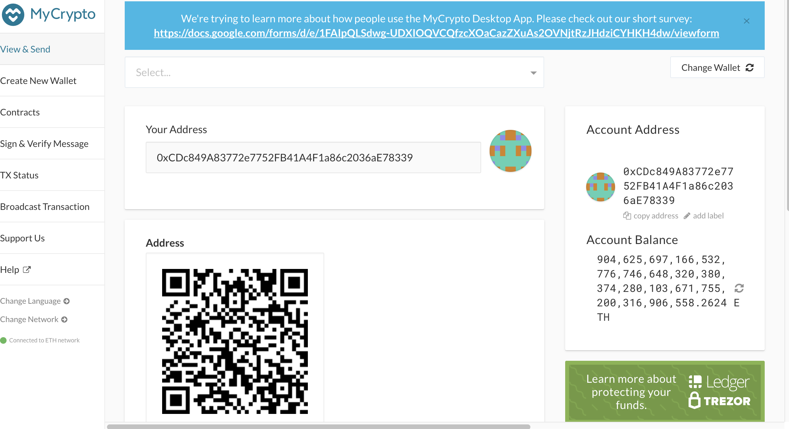
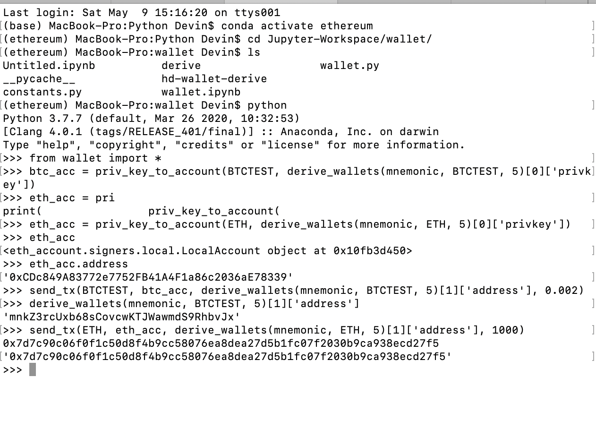
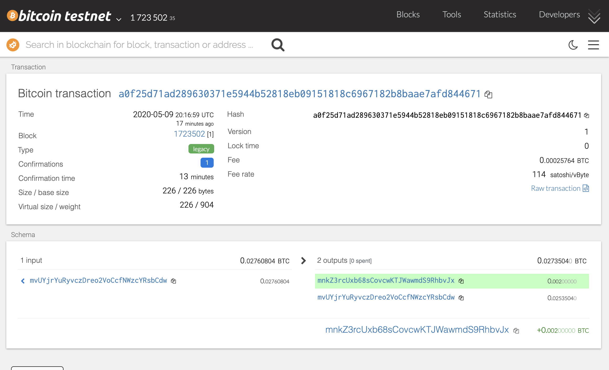
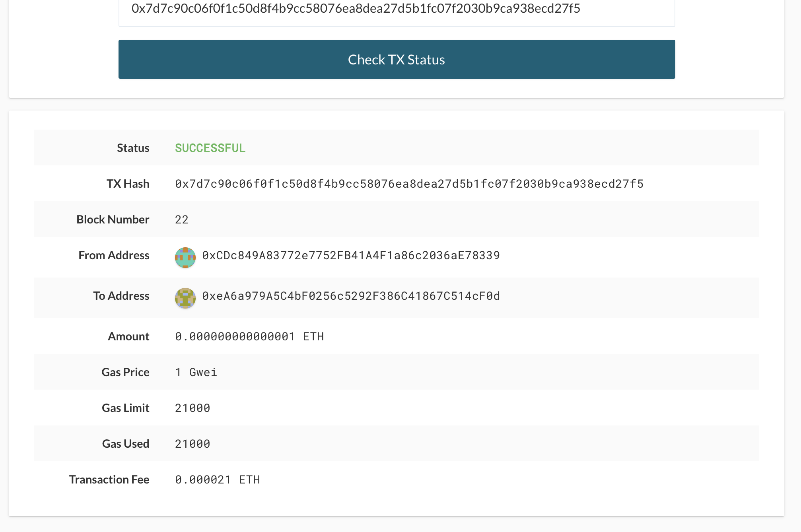

# Crypto_Transactor

## HD-Wallet_Derive
HD-wallet_derive is a Python repository that allows for the ability to derive cryptocurrency accounts associated with a given mnemonic. It was copied into my repository for reference and a symlink was established with hd-wallet-derive.php to the wallet folder. This allows for a more the file to be called in other files without its path being referenced.

## Jupyter Lab files
A file, constants.py, was created that holds the variables BTC, ETH, BTCTEST and a .env file was created to hold a mnemonic as the variable MNEMONIC. In Jupyter Lab another file, wallet.py, was created to hold functions that would allow a user to send transactions with Ethereum and Bitcoin using either Jupyter or the command line.

## Funding of Accounts
In order to be able to send funds using the functions created, I had to fund a Bitcoin account and Ethereum account. I chose the master private key generated from the wallet_derive() function for both coins. I funded bitcoin using the BlockCypher faucet.

To fund an Ethereum account, I added the first derived address to the list of addresses pre-funded by a previously generated genesis block (crypto_net.json).

I then deleted the previous geth folders under two node folders linked to the genesis block, and re-initiated the previously created nodes.

Then I initiated mining on each of the nodes.

To verify that the new Ethereum account was funded, I logged into the account using MyCrypto.

I then opened a new command line window, navigated to the wallet folder, and opened a pyton shell. I imported all content in wallet.py, set variables to hold byts objects created from the newly funded Bitcoin and Ethereum accounts. Then, I used the send_tx() function to send both a Bitcoin and Ethereum transaction to another account listed when derive_wallets() is called for each given coin.

To confirm the transactions were successful, I copied the recipient address and searched for it on a block explorer. I found the transaction confirmation.

For Ethereum, I copied the transaction hash generated in the command line above, logged onto MyCrypto, and checked the transaction status of the hash, where I located the confirmation.

